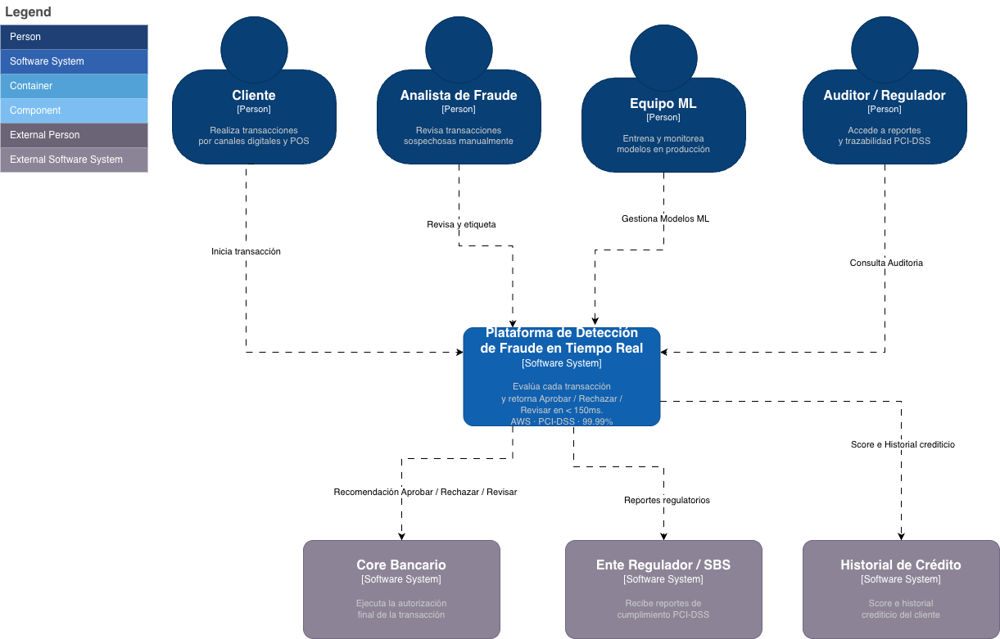
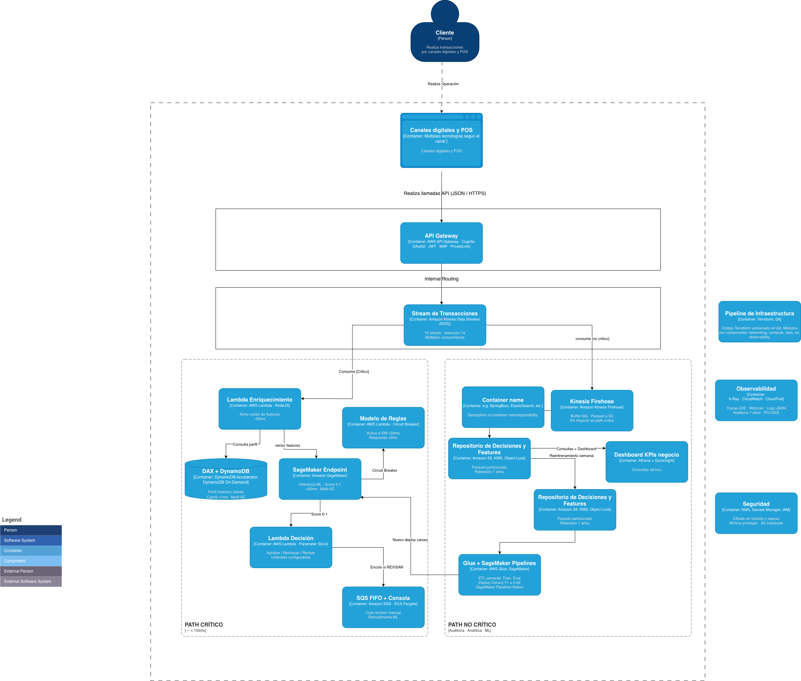
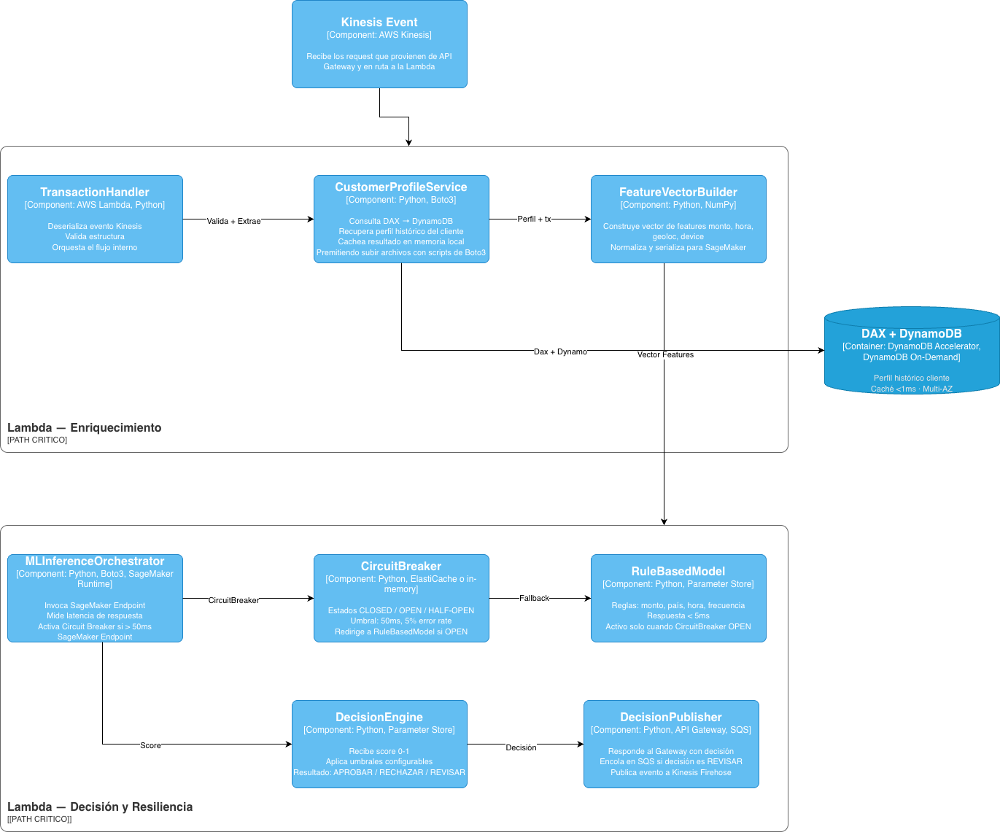

# Diagrama de arquitectura de software 

Los diagramas se encuentran bajo el Modelo C4, framework de diagramación de arquitectura de software. 

De los 4 niveles que tienes se está considerando los 3 primeros. C1 Contexto (El sistema y quien interactúa con él), C2 Contenedores (Los bloques técnicos que le componen) y C3 Componentes (El interior de un contenedor especifico) 

# C1 - Contexto

# C2 - Contenedores

# C3 - Componentes

